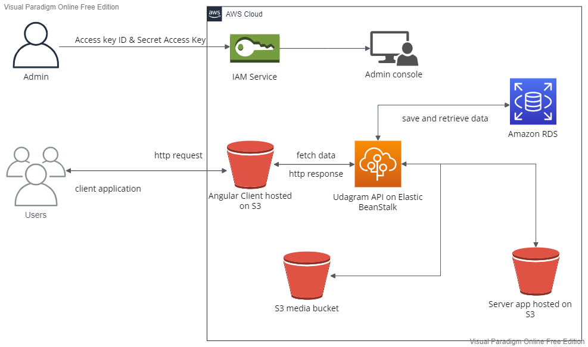

## Additional information
### 1- Infrastructure description
The application runs on the following infrastructure.
- Postgres AWS RDS instance hosting the database.
- Elastic Beanstalk instance running the server app.
- S3 Bucket for static website hosting.
- S3 Bucket hosting the server app.
- S3 Bucket for media hosting.
### 2- App dependencies
```
- Node v14.15.1 (LTS) or more recent. While older versions can work it is advisable to keep node to latest LTS version

- npm 6.14.8 (LTS) or more recent, Yarn can work but was not tested for this project

- AWS CLI v2, v1 can work but was not tested for this project

- A RDS database running Postgres.

- A S3 bucket for hosting uploaded pictures.
```
### 3- Pipeline process

### 4- AWS architecture diagram
